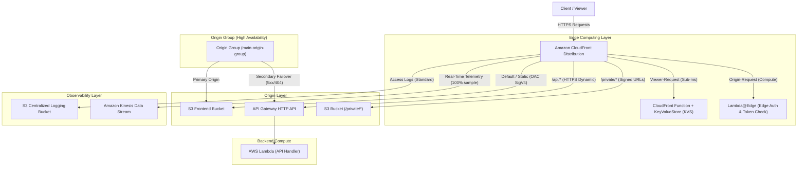

# AWS CloudFront Deep Dive — Terraform IaC

A modular Infrastructure-as-Code (IaC) repository built using **Terraform** to implement, test, and validate advanced **Amazon CloudFront** patterns, multi-origin routing, edge computing, origin security via Origin Access Control (OAC), private content authorization, and real-time observability.

*Developed as part of a Cloud Engineer internship project at Whistlemind Technologies.*

---

## Architecture



---

## Key Cloud Capabilities

| Capability Domain | Implemented Features |
| :--- | :--- |
| **Content Delivery** | Multi-origin routing, custom cache policies, compression (`gzip`/`brotli`), HTTP-to-HTTPS redirection, PriceClass_100 cost optimization. |
| **Origin Security** | S3 Origin Access Control (OAC) with SigV4 signing; public access blocks; direct S3 access restriction. |
| **Access Authorization** | CloudFront Trusted Key Groups and RSA Public Keys enforcing Signed URLs on `/private/*`. |
| **Edge Computing** | CloudFront Functions (runtime `cloudfront-js-2.0`) with CloudFront KeyValueStore (KVS) at `viewer-request`; Lambda@Edge (NodeJS 18.x in `us-east-1`) at `origin-request`. |
| **Reliability & HA** | CloudFront Origin Groups configured with automatic failover criteria (`500`, `502`, `503`, `504`, `404`). |
| **Observability** | Centralized S3 standard access logging with 30-day lifecycle rules; real-time Kinesis Data Streams logging with IAM delivery policies. |
| **Infrastructure as Code** | Fully modular Terraform structure, explicit multi-region provider aliasing (`ap-south-1` for regional resources, `us-east-1` for edge functions and KVS). |

---

## Architecture Components

1. **Amazon CloudFront**: Acts as the single entry point and global content delivery network, routing requests based on path patterns (`/`, `/api/*`, `/private/*`).
2. **Amazon S3 & Origin Access Control (OAC)**: Hosts static frontend assets (`index.html`, `app.js`, assets). OAC ensures S3 objects are only readable via authenticated SigV4 requests originating from CloudFront.
3. **Amazon API Gateway (HTTP API v2)**: Acts as the HTTP reverse-proxy origin for dynamic backend requests (`/api/*`), routing requests directly to the backend Lambda function.
4. **AWS Lambda (Backend API)**: Serverless compute engine returning dynamic JSON payloads with custom response headers (`x-omkar-origin: lambda-api`).
5. **Lambda@Edge (`edge-auth`)**: Deployed to `us-east-1` and replicated globally across AWS edge locations to perform token inspection on `origin-request`.
6. **CloudFront Functions & KeyValueStore (KVS)**: Lightweight edge compute runtime executing key-value lookups at sub-millisecond latency on `viewer-request`.
7. **CloudFront Public Key & Key Group**: Manages RSA public keys to validate CloudFront Signed URLs for restricted assets.
8. **Amazon Kinesis Data Streams & S3 Logging**: Ingests real-time edge access telemetry (sampling rate: 100%) and archives standard access logs with automated expiration.
9. **AWS Identity and Access Management (IAM)**: Defines least-privilege trust relationships and execution roles for Lambda, Lambda@Edge, and CloudFront log delivery.
10. **AWS WAF v2 (Optional Module)**: Provides Web ACL definitions for IP blocking, rate-based throttling, and AWS Managed Core Rule Sets.

---

## Terraform Structure

```
cf-deep-dive/
├── main.tf                         # Root module orchestrating all submodules
├── variables.tf                    # Root input variables (aws_region, env)
├── locals.tf                       # Standardized naming prefix and common tags
├── outputs.tf                      # Root outputs (CF domain, S3 bucket, API endpoint, Key Group)
├── providers.tf                    # AWS providers (default ap-south-1, alias us_east_1)
├── terraform.tfvars.example        # Example input configuration file
├── .gitignore                      # Security-hardened gitignore (ignores state, tfvars, .pem)
├── cf-signed-url/                  # Directory for local RSA key pair generation
├── static-site/                    # Frontend static assets uploaded to S3
│   ├── index.html                  # Main application entry page
│   ├── app.js                      # Client script inspecting headers/cookies
│   ├── image.jpg                   # Static image asset
│   ├── lang/                       # Localized static HTML pages (en.html, mr.html)
│   ├── private/                    # Protected assets (report.html)
│   └── secure/                     # Dashboard assets
└── modules/                        # Reusable Terraform Submodules
    ├── cloudfront/                 # Distribution, cache/origin policies, OAC, KVS, Key Groups
    │   └── functions/              # CloudFront Function JavaScript code (kvs-greetings.js)
    ├── s3/                         # Frontend S3 bucket, public access block, bucket policy, assets
    ├── apigw/                      # HTTP API Gateway v2, $default stage, routes, permissions
    ├── lambda/                     # Backend Lambda & Lambda@Edge functions (edge-auth, geo-router)
    ├── iam/                        # IAM roles & policies for Lambda and edge execution
    ├── logging/                    # S3 logging bucket (lifecycle + ACLs) & Kinesis real-time stream
    └── waf/                        # Optional AWS WAF v2 Web ACL definitions
```

### Module Breakdown

| Module | Responsibility | Key Resources Created |
| :--- | :--- | :--- |
| `modules/s3` | Storage & Assets | `aws_s3_bucket`, `aws_s3_bucket_public_access_block`, `aws_s3_bucket_policy`, `aws_s3_object` |
| `modules/cloudfront` | Edge Distribution | `aws_cloudfront_distribution`, `aws_cloudfront_origin_access_control`, `aws_cloudfront_cache_policy`, `aws_cloudfront_key_value_store`, `aws_cloudfront_function`, `aws_cloudfront_key_group` |
| `modules/apigw` | API Routing | `aws_apigatewayv2_api`, `aws_apigatewayv2_integration`, `aws_apigatewayv2_route`, `aws_apigatewayv2_stage`, `aws_lambda_permission` |
| `modules/lambda` | Serverless & Edge | `aws_lambda_function.api`, `aws_lambda_function.edge_auth`, `aws_lambda_function.geo_router` |
| `modules/iam` | Access Control | `aws_iam_role.lambda_exec`, `aws_iam_role_policy_attachment.basic` |
| `modules/logging` | Telemetry & Audit | `aws_s3_bucket.logs`, `aws_kinesis_stream.cf_realtime`, `aws_cloudfront_realtime_log_config.cf_logs` |
| `modules/waf` | Edge Protection (Optional) | `aws_wafv2_web_acl`, `aws_wafv2_ip_set` |

---

## Deployment

### Prerequisites
- [Terraform](https://www.terraform.io/downloads) (>= 1.0)
- [AWS CLI](https://aws.amazon.com/cli/) configured with valid administrator credentials
- [OpenSSL](https://www.openssl.org/) for RSA key pair generation

### Step 1: Generate Key Pair for CloudFront Signed URLs
Before applying the infrastructure, generate an RSA key pair locally:

```bash
# 1. Generate a 2048-bit RSA private key
openssl genrsa -out cf-signed-url/private_key.pem 2048

# 2. Extract the public key in PEM format for CloudFront
openssl rsa -pubout -in cf-signed-url/private_key.pem -out modules/cloudfront/public_key.pem

# 3. Copy public key to cf-signed-url for local signing scripts (optional)
cp modules/cloudfront/public_key.pem cf-signed-url/public_key.pem
```

> [!IMPORTANT]
> Never commit `private_key.pem` to source control. The `.gitignore` file is preconfigured to prevent private keys from being tracked.

### Step 2: Initialize and Deploy with Terraform

```bash
# Initialize providers and submodules
terraform init

# Review execution plan
terraform plan

# Deploy infrastructure
terraform apply
```

### Step 3: Inspect Outputs
After successful deployment, Terraform outputs key details:
- `cloudfront_domain_name`: CloudFront distribution endpoint (e.g., `d123456abcdef8.cloudfront.net`)
- `s3_bucket_name`: Frontend S3 bucket name
- `api_gateway_endpoint`: Direct API Gateway HTTP endpoint
- `cloudfront_key_group_id`: Key Group ID for Signed URL generation

---

## Verification & Practical Scenarios

### Scenario 1: Static Content Delivery (S3 via CloudFront)
Fetch the static frontend home page through the CloudFront edge:
```bash
curl -i https://<CLOUDFRONT_DOMAIN>/index.html
```
- **Expected Result**: `HTTP/2 200 OK` with `x-cache: Hit from cloudfront` (on repeated requests) and static HTML body.

---

### Scenario 2: S3 Origin Protection via OAC
Verify that direct access to the S3 bucket is blocked and only accessible through CloudFront:
```bash
# Direct S3 bucket request (Bypassing CloudFront)
curl -i https://<S3_BUCKET_NAME>.s3.ap-south-1.amazonaws.com/index.html
```
- **Expected Result**: `HTTP/1.1 403 Forbidden` (`AccessDenied`). S3 accepts requests signed only by the CloudFront service principal (`cloudfront.amazonaws.com`) via SigV4.

---

### Scenario 3: Multi-Origin API Routing (API Gateway + Lambda)
Request the backend API endpoint through CloudFront:
```bash
curl -i https://<CLOUDFRONT_DOMAIN>/api/users
```
- **Expected Result**: `HTTP/2 200 OK` with `x-omkar-origin: lambda-api`, returning JSON:
  ```json
  {"message":"Hello Omkar 🚀","time":"..."}
  ```

---

### Scenario 4: Edge Processing with CloudFront Function & KeyValueStore (KVS)
CloudFront Functions intercept `viewer-request` events at the edge and perform sub-millisecond lookups against CloudFront KeyValueStore:
```bash
# Look up greeting key
curl -i https://<CLOUDFRONT_DOMAIN>/india
curl -i https://<CLOUDFRONT_DOMAIN>/global
```
- **Expected Result**: `HTTP/2 200 OK` returning `Namaste` or `Hello` directly from the CloudFront edge without hitting any origin.

---

### Scenario 5: Edge Authentication via Lambda@Edge
The `edge-auth` Lambda@Edge function inspects incoming query parameters on `origin-request`:
```bash
# Request without authorization token (Fails at edge)
curl -i https://<CLOUDFRONT_DOMAIN>/index.html
# Output: HTTP/2 403 Forbidden (Body: "Access Denied")

# Request with valid token parameter (Succeeds)
curl -i https://<CLOUDFRONT_DOMAIN>/index.html?token=omkar123
# Output: HTTP/2 200 OK
```

---

### Scenario 6: Private Content Authorization (Signed URLs & Key Groups)
The `/private/*` path behavior requires a valid CloudFront signature created with the trusted RSA private key:
```bash
# Request private report without signature (Fails)
curl -i https://<CLOUDFRONT_DOMAIN>/private/report.html
```
- **Expected Result**: `HTTP/2 403 Forbidden` (`MissingKey` / `AccessDenied`).
- **Authorized Request**: When accessed using a valid signed URL generated with `cf-signed-url/private_key.pem` and the Key Group ID, CloudFront verifies the signature and serves the private report.

---

### Scenario 7: Origin Group High Availability & Failover
CloudFront is configured with an Origin Group (`main-origin-group`):
- **Primary Origin**: S3 Frontend Bucket
- **Secondary Origin**: API Gateway
- **Failover Criteria**: HTTP Status `500`, `502`, `503`, `504`, `404`.
If the primary origin returns any configured error code, CloudFront automatically reroutes the request to the secondary origin seamlessly.

---

### Scenario 8: Observability & Telemetry
1. **Standard Access Logs**: Stored in the centralized S3 logging bucket under the `cloudfront/` prefix.
2. **Real-time Logs**: Streamed with 100% sampling rate into the Amazon Kinesis Data Stream (`${prefix}-cf-realtime`) capturing fields such as `timestamp`, `c-ip`, `cs-method`, `cs-uri-stem`, `sc-status`, `time-to-first-byte`, and `x-edge-result-type`.

---

## Security Considerations

1. **Origin Access Control (OAC)**: Replaces legacy Origin Access Identities (OAI). OAC supports all S3 buckets in all AWS regions, SSE-KMS encryption, and dynamic SigV4 request signing.
2. **Least Privilege IAM Policies**: The Lambda execution role attaches strictly `AWSLambdaBasicExecutionRole` for CloudWatch logging, while Kinesis log delivery uses a dedicated CloudFront service principal trust policy.
3. **Private Key Management**: Private keys are generated locally and excluded from version control via `.gitignore`. CloudFront only stores the public key in a Key Group.
4. **WAF Edge Filtering (Optional)**: Provides proactive protection at CloudFront edge locations against Layer 7 DDoS, rate exhaustion (200 requests/IP limit), and common web vulnerabilities (OWASP Top 10 via AWSManagedRulesCommonRuleSet).

---

## Failure / Troubleshooting Scenarios

| Issue / Symptom | Root Cause | What to Check & Fix |
| :--- | :--- | :--- |
| **403 Forbidden on S3 Objects** | Bucket policy missing or OAC not attached | 1. Check `aws_s3_bucket_policy.allow_cloudfront` allows `cloudfront.amazonaws.com`.<br>2. Verify `origin_access_control_id` is linked to `s3-origin`.<br>3. Check S3 object key exists. |
| **502 Bad Gateway on API Route** | API Gateway endpoint mismatch or Lambda failure | 1. Ensure `domain_name` in CloudFront origin has no `https://` prefix.<br>2. Verify `aws_lambda_permission.apigw` permits `apigateway.amazonaws.com` invocation.<br>3. Inspect CloudWatch Logs for the backend Lambda function. |
| **502 / 503 from Lambda@Edge** | Lambda@Edge handler syntax error or incorrect return structure | 1. Lambda@Edge must return a valid request or response object structure.<br>2. Check CloudWatch Logs in the region closest to where the request was made (or `us-east-1`). |
| **403 MissingKey on `/private/*`** | Missing or invalid Signed URL parameters | 1. Ensure `Key-Pair-Id` matches the active CloudFront Public Key ID.<br>2. Verify the signature is computed using SHA-1/RSA with the corresponding private key.<br>3. Check that the expiry timestamp (`Expires` epoch) is in the future. |

---

## Cleanup

To destroy all provisioned AWS resources and prevent ongoing costs:

```bash
terraform destroy
```

> [!NOTE]
> When destroying Lambda@Edge associations, AWS CloudFront may take a few extra minutes to remove edge function replicas from all worldwide edge locations before the IAM execution role can be deleted.

---

## What I Learned

- Designing multi-origin CloudFront distributions with fine-grained cache behaviors and origin request policies.
- Securing origin storage by replacing legacy OAIs with SigV4-based Origin Access Control (OAC).
- Distinguishing performance and execution trade-offs between sub-millisecond **CloudFront Functions** (viewer-request) and full-runtime **Lambda@Edge** (origin-request).
- Structuring modular Terraform configurations with multi-region provider aliases (`ap-south-1` vs `us-east-1` for edge services).
- Implementing edge-based authorization patterns using CloudFront Key Groups and Signed URLs.
- Setting up dual observability pipelines with S3 access logging and real-time Kinesis telemetry.

---

## Interview Talking Points

### 1. Why place CloudFront in front of an S3 bucket instead of serving directly from S3?
CloudFront caches content across a worldwide network of edge locations, significantly reducing latency and offloading traffic from the origin. It adds capabilities S3 website hosting lacks: TLS 1.3 certificate termination, Origin Access Control (OAC) to keep S3 entirely private, edge compute customization, compression, custom header manipulation, and DDoS protection via AWS Shield.

### 2. What is Origin Access Control (OAC), and why is it preferred over Origin Access Identity (OAI)?
OAC is AWS's modern mechanism to secure S3 origins behind CloudFront. Unlike legacy OAI, OAC supports:
- AWS SigV4 / SigV4a signing protocol
- S3 buckets encrypted with AWS KMS (SSE-KMS)
- All AWS regions (including opt-in regions)
- HTTP `PUT` and `DELETE` requests
- Granular resource-based policies using `AWS:SourceArn` conditions.

### 3. What is the difference between CloudFront Functions and Lambda@Edge?
- **CloudFront Functions**: Lightweight JavaScript (ES 5.1 / JS 2.0) runtime running directly at 600+ CloudFront edge locations. Executes in sub-milliseconds with low cost. Supports only `viewer-request` and `viewer-response` events. Cannot access request body or make external network calls.
- **Lambda@Edge**: Full NodeJS/Python runtime running at Regional Edge Caches. Supports all 4 event triggers (`viewer-request`, `origin-request`, `origin-response`, `viewer-response`), network access, AWS SDK calls, and request body manipulation, with higher latency (tens of milliseconds).

### 4. Why does Terraform require a provider alias in `us-east-1` for edge resources?
AWS CloudFront is a global service whose control plane and edge associations (Lambda@Edge, CloudFront Functions, CloudFront KeyValueStore, and CloudFront-scoped WAFv2 Web ACLs) are managed exclusively through the `us-east-1` (N. Virginia) region. Terraform uses an aliased provider (`aws.us_east_1`) to deploy these resources while keeping regional resources (S3, API Gateway, backend Lambda) in the primary region (`ap-south-1`).

### 5. How does CloudFront Origin Group failover work?
An Origin Group contains a primary origin (e.g., S3) and a secondary origin (e.g., API Gateway). CloudFront sends the request to the primary origin first. If the primary origin fails to respond or returns configured HTTP status codes (`500`, `502`, `503`, `504`, or `404`), CloudFront intercepts the error and immediately redirects the request to the secondary origin before returning a response to the viewer.

### 6. How are private objects protected under `/private/*` in this project?
The `/private/*` cache behavior attaches an `aws_cloudfront_key_group`. Requests without valid CloudFront Signed URL query parameters (`Expires`, `Signature`, `Key-Pair-Id`) are rejected at the edge with `403 Forbidden`. The signature can only be generated using the private RSA key that pairs with the public key registered in the Key Group.

### 7. How are CloudFront cache keys determined in this configuration?
Cache policies (`aws_cloudfront_cache_policy`) explicitly define what parameters are included in the cache key. For static content, query strings like `id` are whitelisted while headers and cookies are omitted to maximize cache hit ratio. For dynamic API endpoints, caching is disabled (TTL=0) and all query strings, cookies, and `Accept-Language` headers are forwarded to the origin.

### 8. Where are CloudFront logs stored and what observability pipelines are configured?
This project implements dual observability:
1. **Standard Access Logs**: Batched access logs delivered to a dedicated S3 logging bucket (`${prefix}-central-logs`) with automated 30-day lifecycle expiration.
2. **Real-Time Logs**: Streaming access logs delivered with 100% sampling rate into an Amazon Kinesis Data Stream (`${prefix}-cf-realtime`) for real-time monitoring and SIEM integration.

### 9. What IAM permissions were configured for Lambda@Edge?
Lambda@Edge requires an IAM trust policy allowing both `lambda.amazonaws.com` and `edgelambda.amazonaws.com` to assume the role. The execution role has `AWSLambdaBasicExecutionRole` attached to write execution logs to CloudWatch Logs across whichever AWS edge region executes the function.

### 10. How do you troubleshoot a 403 Forbidden response from CloudFront?
1. **Check the response headers**: Look at `Server: CloudFront` and `X-Cache` to see if the block occurred at the edge or origin.
2. **Check Signed URL / Key Group**: If accessing `/private/*`, verify that the signed URL has not expired and the `Key-Pair-Id` matches the public key in the Key Group.
3. **Check S3 Bucket Policy & OAC**: Verify that S3 bucket policy allows `s3:GetObject` for `cloudfront.amazonaws.com` and that OAC is assigned to the S3 origin.
4. **Check Lambda@Edge / CloudFront Functions**: Check function code (e.g., token checks in `edge-auth`) and view regional CloudWatch logs for edge execution failures.

### 11. What happens during `terraform destroy` with Lambda@Edge?
Lambda@Edge functions are replicated to AWS edge locations globally. When CloudFront removes the association, AWS retains the function replicas for a short period to ensure in-flight edge requests finish. Consequently, Terraform may take several minutes to clean up Lambda@Edge associations before the underlying IAM role can be deleted.

### 12. Why should API Gateway origins omit the `https://` protocol prefix in CloudFront origin definitions?
CloudFront `origin.domain_name` expects a pure DNS hostname (e.g., `api-id.execute-api.region.amazonaws.com`). Passing `https://` causes DNS resolution failures and `502 Bad Gateway` errors. In Terraform, this is safely sanitized using `replace(replace(var.api_endpoint, "https://", ""), "/", "")`.
